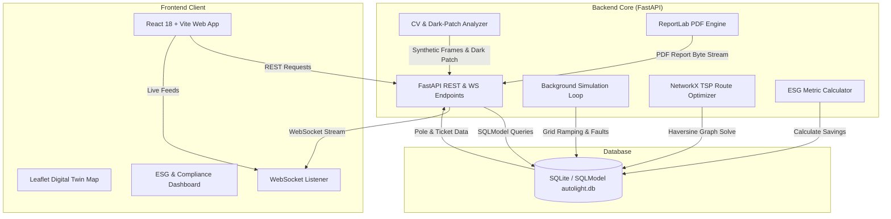

# AutoLight-Civic

**AutoLight-Civic** is an AI-driven, next-generation Smart City Municipal Streetlighting and Automated Maintenance Operations Platform. Designed for modern urban municipal corporations, AutoLight replaces traditional static streetlights with adaptive PWM dimming mesh networks, automated Computer Vision (YOLO) fault detection, graph-based maintenance crew routing (NetworkX TSP), and comprehensive ESG/Carbon footprint telemetry with downloadable municipal compliance reports.


## 🌟 Key Features

### 1. ⚡ Adaptive Municipal Streetlighting Mesh
- **Standby Mode (20% PWM / 20W):** Dynamic baseline reduction when corridors are idle.
- **Motion-Triggered Ramping:** Real-time 100% active illumination on motion detection, plus **60% predictive downstream light cascading** for approaching vehicles/pedestrians.
- **Heavy Fog / Monsoon Amber Mode:** Adaptive 3000K anti-glare color temperature shifts based on ambient humidity and visibility metrics.
- **Emergency Green Corridor Override:** Instant priority lighting corridors for ambulances and fire engines.

### 2. 👁️ Computer Vision & Dark-Patch Fault Detection
- Synthetic **YOLOv8 + OpenCV** inference simulation for live camera streams (`CAM-01`, `CAM-02`, `CAM-03`).
- **Dark-Patch ROI Luminance Analysis:** Automated detection of burnt-out LEDs and circuit trips, instantly generating geotagged critical fault tickets.

### 3. 🚚 Autonomous Maintenance Crew Dispatch & TSP Routing
- Built-in **NetworkX + Haversine spatial graph solver** for Traveling Salesperson Problem (TSP) route optimization.
- Automatically calculates the shortest turn-by-turn repair dispatch route from the Central Depot through all active fault locations, minimizing fuel usage and transit times.

### 4. 📊 ESG & Sustainability Telemetry Dashboard
- Real-time tracking of kWh energy saved vs. 100W static baseline lighting grids.
- Computes CO₂ emission offset (kg/tonnes), monetary electricity cost savings (₹/INR), and Carbon Credits accrued.
- **Automated PDF Export:** Generates official municipal compliance reports (built with ReportLab) ready for government tenders and ESG audits.

### 5. 🗺️ Live Digital Twin & Real-time Web Platform
- Built with **React 18**, **Leaflet**, and **Recharts**.
- Full WebSocket support (`/ws`) for live bidirectional telemetry updates and grid state streaming.
- Built-in **Simulation Control Panel** for live demoing: inject traffic motion, trigger fixture faults, adjust weather parameters, and toggle emergency overrides.


## 🏗️ System Architecture





## 🛠️ Tech Stack

### **Backend**
- **Framework:** Python 3.9+, FastAPI, Uvicorn
- **Database & ORM:** SQLModel, SQLite
- **Algorithms & Graph Theory:** NetworkX, SciPy, NumPy
- **PDF Generation:** ReportLab
- **Real-time Communication:** WebSockets
- **Testing:** Pytest

### **Frontend**
- **Framework & Build Tool:** React 18, Vite (TypeScript/JSX)
- **Styling:** Tailwind CSS, PostCSS, Lucide Icons
- **Mapping & GIS:** Leaflet, React-Leaflet
- **Data Visualization:** Recharts
- **Utility & UI:** `clsx`, `tailwind-merge`, `canvas-confetti`

### **DevOps & Containerization**
- **Docker & Docker Compose**
- **Nginx Reverse Proxy**

---

## 🚀 Getting Started

### Prerequisites
Make sure you have the following installed on your machine:
- **Node.js** (v18.x or later) & `npm`
- **Python** (v3.9 or later) & `pip`
- *(Optional)* **Docker** & **Docker Compose**

---

### Option 1: Quickstart with Docker Compose (Recommended)

Run the entire platform (Backend FastAPI + Frontend React + Nginx) with a single command:

```bash
# Clone the repository
git clone https://github.com/your-username/autolight-civic.git
cd autolight-civic

# Build and start all services
docker-compose up --build
```

Access the application in your browser:
- 🌐 **Frontend Dashboard:** [http://localhost:3000](http://localhost:3000)
- 🔌 **Backend API Docs (Swagger):** [http://localhost:8000/docs](http://localhost:8000/docs)

---

### Option 2: Local Development Setup

#### 1. Backend Setup (FastAPI)

```bash
# Navigate to backend directory
cd backend

# Create a virtual environment
python -m venv venv
source venv/bin/activate  # On Windows: venv\Scripts\activate

# Install dependencies
pip install -r requirements.txt

# Start the FastAPI server (Seeding database automatically)
uvicorn main:app --reload --port 8000
```
The FastAPI server will start on `http://localhost:8000`.

#### 2. Frontend Setup (React + Vite)

```bash
# Open a new terminal and navigate to frontend directory
cd frontend

# Install dependencies
npm install

# Start Vite development server
npm run dev
```
The frontend dashboard will be available at `http://localhost:5173` (or `http://localhost:3000`).

---

## 📡 API Documentation & Endpoints

FastAPI generates automatic interactive OpenAPI documentation. Visit **`http://localhost:8000/docs`** when running the backend.

### Key API Endpoints

| Method | Endpoint | Description |
| :--- | :--- | :--- |
| `GET` | `/api/poles` | Fetch status, location, and brightness of all streetlight poles |
| `POST` | `/api/poles/inject-motion` | Simulate vehicle/pedestrian movement on a pole corridor |
| `POST` | `/api/poles/inject-fault` | Simulate physical bulb/circuit failure and create fault ticket |
| `POST` | `/api/poles/inject-weather` | Toggle Heavy Fog / Monsoon Mode (Amber anti-glare PWM) |
| `POST` | `/api/poles/reset` | Reset all non-faulty poles to Standby Mode (20% PWM) |
| `POST` | `/api/emergency/trigger` | Activate Emergency Green Corridor lighting wave |
| `POST` | `/api/emergency/clear` | Clear Emergency Green Corridor override |
| `GET` | `/api/tickets` | Fetch active and resolved maintenance fault tickets |
| `POST` | `/api/tickets/{id}/resolve` | Resolve a fault ticket and restore target pole to Standby |
| `POST` | `/api/dispatch` | Compute TSP autonomous maintenance crew repair route |
| `GET` | `/api/analytics` | Fetch real-time power draw and percentage energy savings |
| `GET` | `/api/cv-feed` | Synthetic OpenCV + YOLO live frame luminance analysis |
| `GET` | `/api/esg/metrics` | Detailed ESG sustainability telemetry (kWh, CO₂, INR savings) |
| `GET` | `/api/esg/report/pdf` | Download official Municipal Compliance ESG PDF Report |
| `WS` | `/ws` | Real-time WebSocket connection for live telemetry updates |

---

## 🧪 Simulation & Interactive Demo Guide

The frontend features an interactive **Simulation Control Panel** designed for live demonstrations:

1. **Simulate Motion:** Click `Inject Motion` to trigger vehicle transit. Watch target poles jump to **100% brightness** and downstream poles ramp to **60% predictive brightness**.
2. **Simulate Hardware Fault:** Trigger a fault on any pole. The system turns the fixture OFF (0W), flags the node red on the map, and automatically generates an open `CRITICAL` fault ticket.
3. **Dispatch Repair Route:** Click `Compute Route` in the Dispatch Modal to run the TSP graph solver. Observe turn-by-turn directions and shortest repair transit paths from Central Depot.
4. **Monsoon / Weather Override:** Activate Fog Mode to watch PWM values shift to 3000K warm anti-glare spectrum.
5. **Emergency Green Corridor:** Select an emergency corridor (e.g., Grand Avenue) to trigger an immediate priority green corridor wave.

---

## 📄 ESG & PDF Report Generation

AutoLight-Civic allows municipal administrators to download official compliance reports for audits and government tenders.

To generate a report manually via `curl` or browser:
```bash
curl -O "http://localhost:8000/api/esg/report/pdf?municipality_name=Bengaluru%20Smart%20City&tender_ref_no=SMC-2026-094"
```
Or directly click the **"Export PDF Compliance Report"** button inside the ESG Dashboard on the web application.

---

## 🧪 Testing

To run backend automated unit and integration tests using `pytest`:

```bash
cd backend
pytest
```

---

## 📜 License

This project is licensed under the MIT License - see the [LICENSE](LICENSE) file for details.
